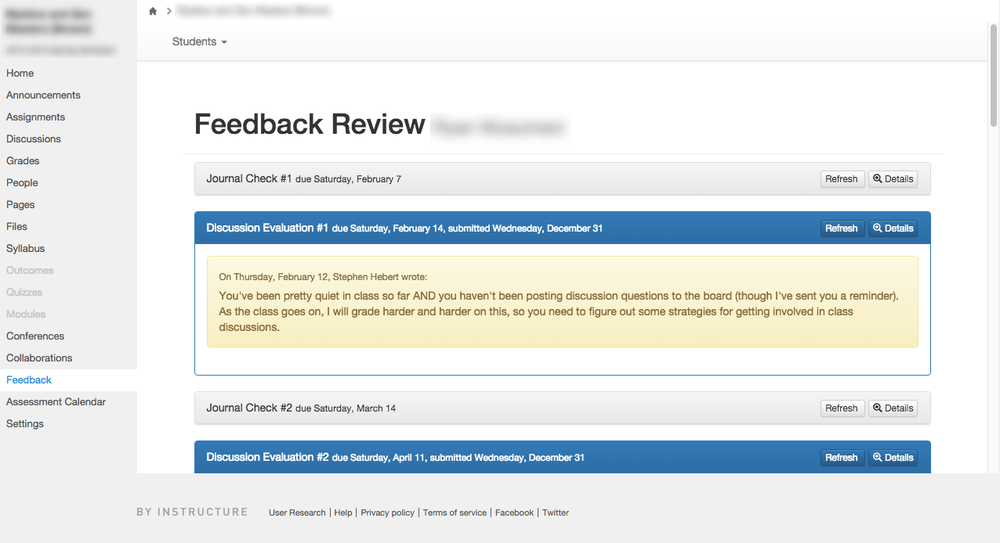

# Student Feedback Review LTI

Review all feedback left for a particular student

This API-driven LTI (built using the [Canvas APi via LTI Starter](https://github.com/smtech/starter-canvas-api-via-lti)) presents students and teachers with all of their assignment feedback as a single narrative, rather than broken into discrete chunks across assignments. This provides the capability for learners and teachers to review this feedback as an extended conversation over the length of a course.

The LTI provides a teacher view (screenshot above) to browse through individual student narratives, and a nearly-identical student view (really the only difference is that there's no menu to switch students).

The app pulls assignment comments via the Canvas API and caches it locally.
